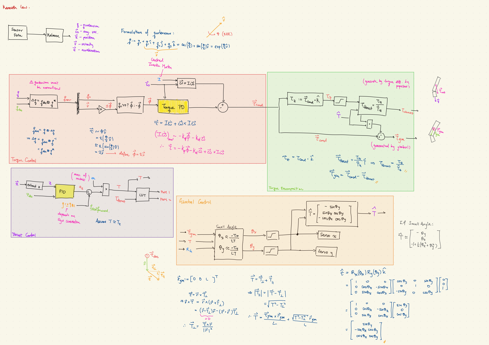

The most recent tentative proposal for the control algorithm is found below. Not that this may be subject to changes as we are still currently validating it. 

[See Rocket_Proposal](Rocket_Proposal.pdf)

Sources:
- Design, Optimal Guidance and Control of a Low-cost Re-usable Electric Model Rocket | Spannagal et al. | 2021 | https://arxiv.org/pdf/2103.04709
- Full Quaternion Based Attitude Control for a Quadrotor | Fresk and Nikolakopoulos | 2013 
