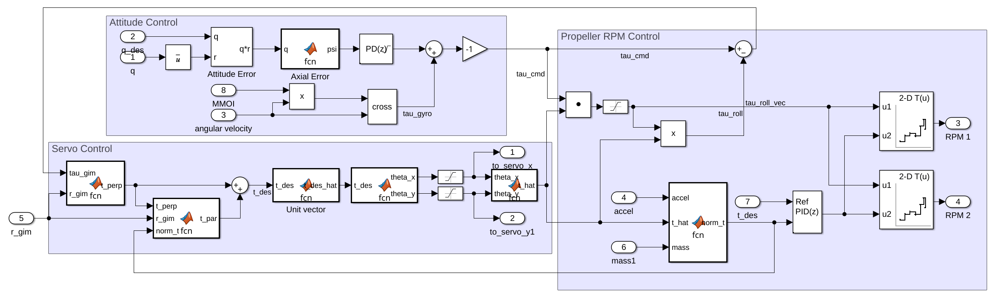

Introduction

The control architecture for the Phase 1 system will utilize active control for roll stabilization, thrust magnitude, and gimbal position.

 

Main Body

The rocket control system can be broken down into three main parts:

Thrust Magnitude: Controlled by varying the speeds of the contra-rotating propellers. 

Thrust Vector: Controlled based on the attitude of the gimbal, which is driven by servos on the x and y axes respectively.

Roll Torque Stabilization: Controlled mainly by varying the speeds of the propellers, with help from the gimbal.

 

The main challenge of designing the flight controller lies in how coupled or interdependent the state variables are:

- Moving the gimbal to stabilize attitude will inadvertently introduce a roll torque 
- Propeller rotation without simultaneous correction of gimbal angle means that the rocket attitude will increase until it is out of control 
- Shifting the gimbal angle will change the thrust magnitude in the +z direction, which the propellers will have to compensate for 

After consulting several research papers on quaternion-based quasi-PID control systems and combining relevant equations to the Phase 1 rocket, the following rough draft of the control system was proposed:


A block diagram of the system was then created in Simulink for simulation and testing purposes:



The MATLAB version of the architecture (PID not included):

```
%{

Symbolic Variables:

q_des   : desired quaternion [4x1] 
q_meas  : quaternion from Kalman filter [4x1]
tau_gim : torque generated from gimbal; accounted for later in calculations [1x3]
r_gim   : vector describing the orientation of the gimbal [1x3]
t       : thrust [1x3]
m       : mass [scalar]
a       : acceleration, obtained from IMU [1x3]
MMOI    : mass moment of inertia of rocket [scalar]
omega   : angular velocity [1x3]

%}


syms q_des q_meas tau_gim r_gim t m a MMOI omega

q_err       = quatmultiply(q_des, conj(q_meas));

q_0         = q_err(1);
v           = q_err(2:4); v_mag = norm(v); v_hat = v/v_mag; 

phi         = 2*sign(2*atan(v_mag/q_0)*v_hat)*atan(v_mag/q_0)*v_hat;

t_perp      = cross(tau_gim, r_gim)/(norm(r_gim))^2; r_gim_hat = r_gim/norm(r_gim);
t_par       = sqrt((norm(t))^2 - (norm(t_perp))^2)*r_gim_hat;

t_des       = t_perp + t_par; t_des_hat = t_des/norm(t_des);

theta_x     = -atan(t_des_hat(2)/t_des_hat(3));
theta_y     = asin(t_des_hat(1));

t_hat       = [sin(theta_y)
            -sin(theta_x)*cos(theta_y)
            cos(theta_x)*cos(theta_y)];

t_mag       = m*(dot(a, t_hat));

tau_gyro    = cross(MMOI*omega, omega);
tau_cmd     = (tau_gyro + phi);
tau_roll    = (dot(tau_cmd, t_hat))*t_hat;
tau_gim     = tau_cmd - tau_roll; % tau_gim accounted for here

% Note: tau_roll and t_des will be fed into 2 2D look-up tables, which will output the RPMs for each motor

```
