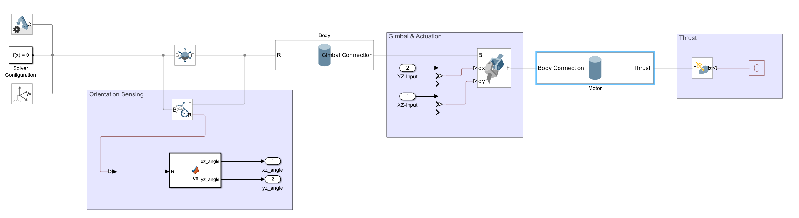
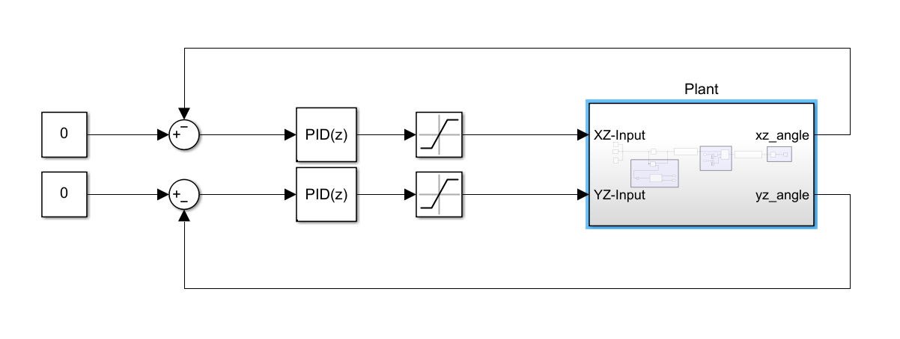

**Introduction:**
The objective of this project was to explore the tools Simscape Multibody offers when it comes to simulating our control system for the rocket. Through the learning process, the project evolved into an implementation that can be adapted to be used with the more comprehensive control architecture.

**Main Body:**
The process started with completing the onramp courses offered by Matlab. Particularly the Simscape Onramp and Multibody Simulation Onramp. These courses are very valuable resources when it comes to reaching competency with simscape and are highly recommended as a first resource if the reader wishes to learn more. 

 
**Simulating The Rocket:**
The next step was to create the actual simulation. The overview of the simulation can be found in figures 1 and 2.

_Figure 1: The overview of the plant. Including the Body and Motor, actuation, and sensors for orientation. It should be noted that the magnitude of the thrust used is constant in this simulation._

_Figure 2: The control algorithm for the thrust vectoring. This algorithm uses two PID loops to control the rocket orientation in the XZ and YZ planes. The limits for gimbal angles are set to 14 degrees._

Plant:

The plant is described in Figure 1, and consists of 3 subparts and the 2 bodies. It should be noted that the blocks that are labeled Motor and Body do not contribute to the control or thrust, but add visualization and inertia. The actual control happens in the highlighted regions.

  Orientation Sensing:

        Uses a transform sensor and a Matlab function to extract angles of the rocket to the Z axis in the XZ and YZ planes and outputs them. The sensor outputs a Rotation Matrix and the Matlab function works with that(Other options such as quaternions are possible).

    Gimbal & Actuation:

        Uses a universal joint(2 DOF) to connect the Body and the Motor. This joint allows us to enter the angle we wish in both axis. Using this we can orient the Motor to stabilize the rocket. This block also allows us to set up limits, or allows control through torque(although it was not used in this instance.)

    Thrust:

        This section uses and External Force and Torque block to implement a constant thrust aligned with the Motor. By changing the angle of the motor to the body, the angle of the thrust is altered.

Control Algorithm:

    The control algorithm can be seen in Figure 2, and consists of 2 discrete PID loops, controlling the  XZ and YZ angles of the rocket respectively, and saturation blocks for gimbal angle limits. It should be noted that the auto tuner application is a very powerful tool to tune our PID in this case.

Future considerations:

Roll control is definitely going to be a very important aspect of implementation here. A solution that can be suggested for the simulation is to write a matlab function to find the gimbal angles from the thrust vector. 

The quaternion implementation also is a few steps away, as the transform sensor can directly output the orientation in quaternion form.

Sources

Provide the sources you consulted that informed your design/decisions, and findings you obtained from the sources.

Websites:

Simscape Onramp | Self-Paced Online Courses - MATLAB & Simulink

    Simscape Onramp is a self paced course that teaches physics based simulations using Simscape

Multibody Simulation Onramp | Self-Paced Online Courses - MATLAB & Simulink

    Multibody Simulation Onramp is an extension to Simscape Onramp that teaches one to use 3 dimensional models to create a comprehensive simulation of a system. It is highly recommended to finish Simscape Onramp before starting this course.
