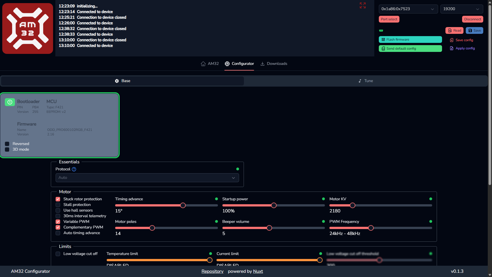
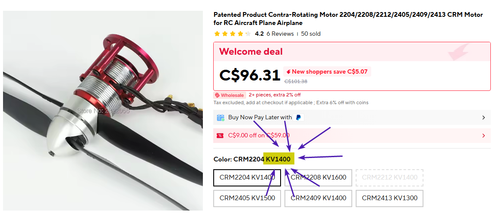

# Working with AM32 ESCs

## Configuring AM32 ESCs

### Connecting to the ESC

1. Open the appropriate AM32 configurator following instructions [here](#am32-configurator)
    1. For the OddityRC Vortex F80 ESCs we are using (<https://oddityrc.com/products/am32-hf32-3-8s-80a-single-esc>), you must use the online configurator since the AM32 firmware version on the ESC is too old
2. Follow the guide at <https://wiki.am32.ca/guides/Arduino-PC-Link.html> for creating a PC link (one of the two methods), and wire up the Arduino PC link according to the diagram in the last section
3. Depending on the type of configurator you are using, you connect via the PC link differently
    1. For the offline configurator, continue with the rest of the steps on the PC link wiki page
    2. For the online configurator, connect to the Arduino PC link using the options on the top right side of the configurator page
4. If you have followed the guide correctly and powered on the PC link and ESC, the ESC should enter the AM32 bootloader
    1. You can tell it has entered the bootloader if the status LED on the ESC stays off
5. You should now be able to read and write the ESC configuration
    1. If you are using the online configurator, the image below shows how the page should look like with a successful connection

### Configuring the ESC for a new motor

1. Follow the guide for [connecting to the ESC](#connecting-to-the-esc)
2. The most important option is the motor KV value, having a wrong KV value could mean that the motor will not run at its optimal speed
    1. The seller for the motor should provide the KV value, see image below

3. Use the configurator to set the KV value
    1. Note that the configurator may not be able to set the exact value (say it can only set values that are multiples of 5, but the motor needs 1777), so just set it to the next closest valid value
4. All other options are optional, some potentially interesting configurations are
    1. Protocol
        1. You can specify the exact protocol we use to communicate with the ESC, however, the auto option is good enough for all scenarios
    2. Brake on Stop
        1. We will likely want this to be disabled
        2. It allows the ESC to apply a braking force whenever we want the motor to stop, which probably isn’t good for the shaft of our motors
    3. Tune
        1. This tab lets you to set the tune that will play on ESC startup
        2. You should also be able to play the tune using special DShot commands

## General Resources

### AM32 Source Code

#### Firmware

<https://github.com/am32-firmware/AM32> 

#### Bootloader

<https://github.com/am32-firmware/AM32-bootloader>

### AM32 Wiki

Webpage: <https://wiki.am32.ca/> 

Source code: <https://github.com/am32-firmware/am32-wiki> 

### AM32 Configurator

#### Online configurator

!!! note
    The online configurator requires a browser with Web Serial support.

!!! warning
    Firefox appears to have issues with receiving data from the ESC over Web Serial. Unsure if this is an issue with the configurator itself, or with the Web Serial implementation on Firefox. Either way, if you cannot read the configuration from the ESC on Firefox, try switching to a Chromium-based browser.

<https://am32.ca/configurator>

#### Offline configurator

<https://github.com/am32-firmware/Offline-Configurator>

- For binary downloads, go to the GitHub releases
